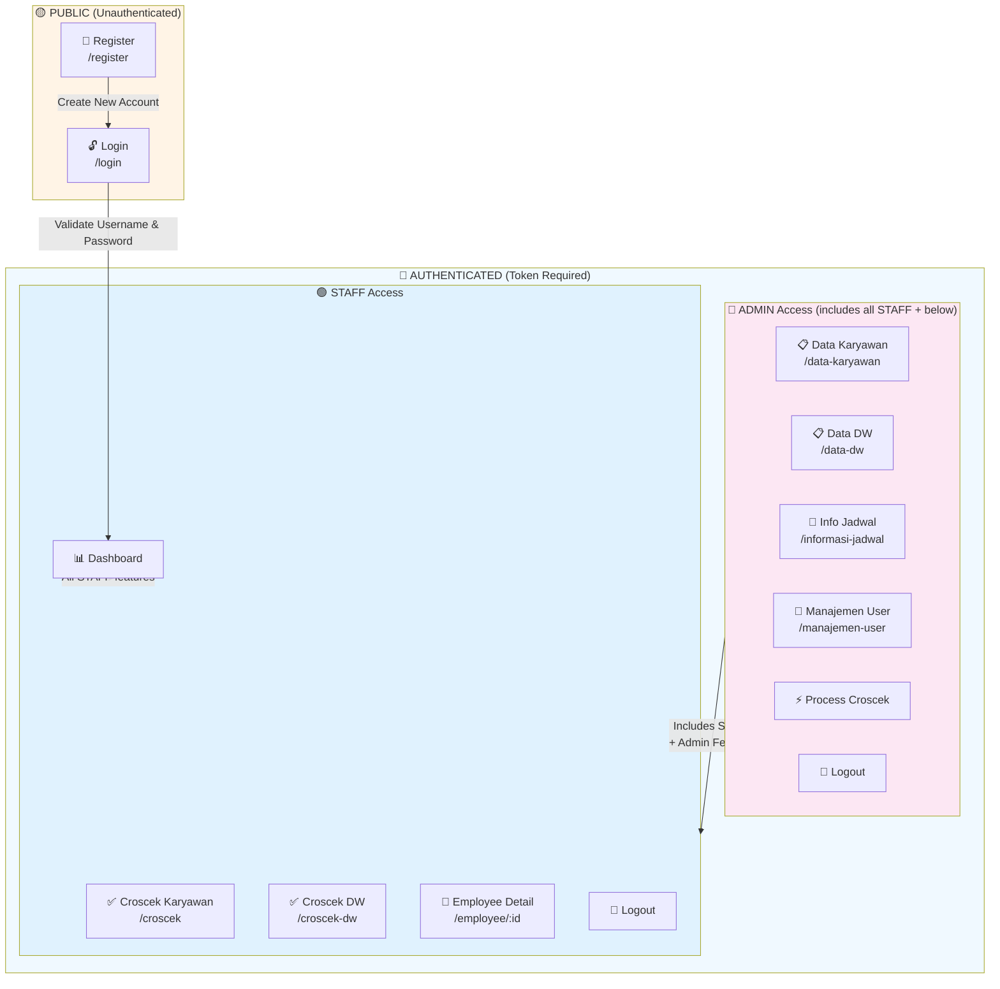
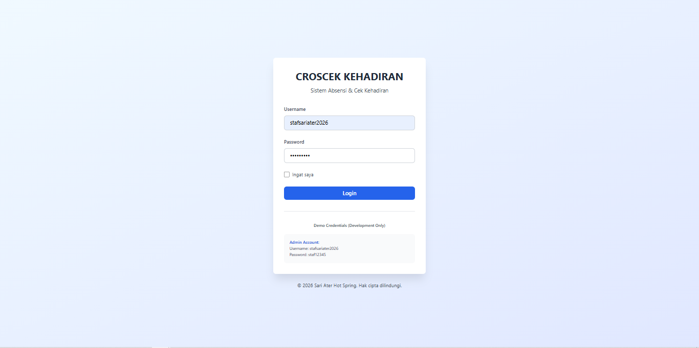
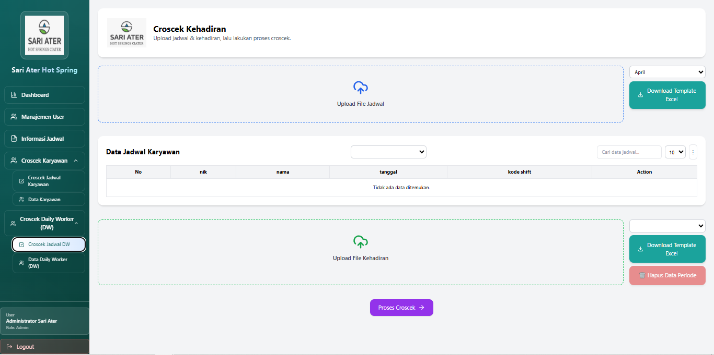

# 🎯 Croscek Kehadiran Karyawan - Frontend

Aplikasi web berbasis React untuk manajemen dan monitoring kehadiran karyawan dengan sistem croscek real-time, analytics dashboard, dan role-based access control.

**Live Demo:** https://sariater-sistem-croscek-frontend.vercel.app/ (Test: `stafsariater2026` / `staf12345`)

---

## 📋 Daftar Isi

### Getting Started
- [Tentang Aplikasi](#tentang-aplikasi)
- [Tools & Persyaratan](#tools--persyaratan)
- [Instalasi](#instalasi)
- [Menjalankan Aplikasi](#menjalankan-aplikasi)

### Features & Navigation
- [Workflow Aplikasi](#workflow-aplikasi)
- [Sistem Prediksi Pindah Shift](#-sistem-prediksi-pindah-shift)
- [Menu Navigation](#menu-navigation)
- [Use Cases & Role Permissions](#use-cases--role-permissions)
- [13 Page Components](#13-page-components)
- [6 Analytics Charts](#6-analytics-charts)
- [UI Components](#ui-components)

### Development
- [Component Architecture](#component-architecture)
- [State Management](#state-management)
- [Styling Guide](#styling-guide)
- [Struktur Folder](#struktur-folder)

### Production
- [Deployment](#deployment)
- [Performance Optimization](#performance-optimization)
- [Security Best Practices](#security-best-practices)
- [Error Handling & Debugging](#error-handling--debugging)

---

## 💼 Tentang Aplikasi

### Guna & Manfaat
**Sistem Croscek Kehadiran Karyawan** adalah aplikasi terintegrasi untuk:

✅ **Manajemen Kehadiran Karyawan**
- Track kehadiran real-time dengan sistem shift
- Monitoring keterlambatan dan keabsenan
- Analisis data kehadiran dengan visualisasi dashboard

✅ **Data Warehouse Integration**
- Integrasi dengan sistem data warehouse untuk reporting
- Historical data tracking dan analytics
- Export report dalam format Excel

✅ **Manajemen Jadwal Shift**
- CRUD jadwal kerja karyawan
- Definisi jam kerja per shift
- Schedule visualization

✅ **Manajemen Karyawan & User**
- Database karyawan lengkap (NIK, nama, departemen, jabatan)
- User management dengan role-based access (Admin/Staff)
- Authentication & authorization system

✅ **Modern UI/UX**
- Glassmorphism design dengan dark theme
- Responsive layout (Mobile, Tablet, Desktop)
- Smooth animations & transitions
- 6 interactive chart visualizations

---

## 🛠 Tools & Persyaratan

### Tools yang Harus Disiapkan

| Tools | Version | Kegunaan |
|-------|---------|----------|
| **Node.js** | ≥ 18.x | Runtime JavaScript |
| **npm** | ≥ 9.x | Package manager |
| **Git** | Latest | Version control |
| **VSCode** | Latest | Code editor (recommended) |
| **Backend Server** | Running | API at :5000 |

### Dependensi Utama

```json
{
  "react": "^19.2.0",
  "react-dom": "^19.2.0",
  "react-router-dom": "^7.9.6",
  "axios": "^1.15.0",
  "recharts": "^3.8.1",
  "tailwindcss": "^3.4.18",
  "vite": "^7.2.4",
  "xlsx": "^0.18.5",
  "exceljs": "^4.4.0"
}
```

---

## 📦 Instalasi

### 1. Clone Repository
```bash
cd d:\Magang\ Hub\croscek-absen
git clone <repository-url>
cd absen-frontend
```

### 2. Install Dependencies
```bash
npm install
```

### 3. Konfigurasi Environment
Buat file `.env.local` di root folder:

```env
# Development
VITE_API_URL=http://localhost:5000/api
VITE_APP_NAME=Croscek Kehadiran
VITE_DEBUG=false
VITE_JWT_TOKEN_KEY=access_token
```

Untuk production (Vercel):
```env
VITE_API_URL=https://api.yourdomain.com/api
VITE_APP_NAME=Croscek Kehadiran
VITE_DEBUG=false
```

### 4. Verifikasi Instalasi
```bash
npm run dev
```

Server akan berjalan di: `http://localhost:5173`

---

## 🚀 Menjalankan Aplikasi

### Development Mode
```bash
npm run dev
```
Server berjalan di `http://localhost:5173` dengan hot reload
- Hot module replacement (HMR) enabled
- Debug konsol tersedia
- Source maps untuk debugging

### Production Build
```bash
npm run build
```
Output di folder `dist/` siap untuk deploy

### Preview Build
```bash
npm run preview
```
Test production build secara lokal di :4173

### Lint & Format
```bash
npm run lint        # Check dengan ESLint
npm run format      # Format dengan Prettier
```

---

## 🔄 Workflow Aplikasi

### 1️⃣ User Login / Register
```
┌─────────────────┐
│   Login Page    │
│  /login         │
└────────┬────────┘
         │
         ├─→ Enter Username & Password
         │   (Demo: stafsariater2026 / staf12345)
         │
         ├─→ Submit Form
         │
         ├─→ POST /api/auth/login
         │   └─ Backend validates
         │
         ├─→ Receive JWT Token
         │
         ├─→ Store in localStorage
         │
         └─→ Redirect /dashboard
```

### 2️⃣ Dashboard Navigation
```
┌──────────────────────────┐
│  Dashboard (Main Hub)    │
│  - KPI Cards (4x)        │
│  - Analytics Charts (6x) │
│  - Top Latecomers        │
│  - Data Quality          │
└──────────┬───────────────┘
           │
           ├─→ Sidebar Menu (Role-Based)
           │   ├─ 📊 Dashboard
           │   ├─ 👥 Croscek Karyawan
           │   │  ├─ Croscek Jadwal
           │   │  └─ Data Karyawan (admin)
           │   ├─ 👷 Croscek DW
           │   │  ├─ Croscek Jadwal DW
           │   │  └─ Data DW (admin)
           │   ├─ 📋 Manajemen User (admin)
           │   └─ 📅 Informasi Jadwal (admin)
           │
           └─→ Each page fetches from Backend API
```

### 3️⃣ Data Upload Flow
```
User: Upload File
   │
   ├─→ Click Upload Button
   │
   ├─→ Select Excel (.xlsx)
   │
   ├─→ Validate:
   │   ├─ File extension
   │   └─ File size (max 10MB)
   │
   ├─→ POST /api/[entity]/upload
   │
   ├─→ Backend processes
   │
   └─→ Display results:
       ├─ Success: "Insert: X, Update: Y"
       ├─ Error: "Format tidak sesuai"
       └─ Warning: List items dengan issues
```

### 4️⃣ Croscek Processing
```
Admin: Process Croscek
   │
   ├─→ Click "Process Croscek"
   │
   ├─→ Backend algorithm:
   │   ├─ Load karyawan & jadwal
   │   ├─ Load attendance records
   │   ├─ For each jadwal:
   │   │  ├─ Find actual check-in
   │   │  ├─ Find actual check-out
   │   │  ├─ Calculate status
   │   │  └─ Predict shift if needed
   │   └─ Upsert results
   │
   └─→ Display results:
       ├─ Croscek Jadwal page
       ├─ Analytics dashboard
       └─ Export to Excel
```

### 5️⃣ Analytics Display
```
Backend aggregates croscek
   │
   ├─→ Calculate metrics:
   │   ├─ Total attendance rate
   │   ├─ Tardiness count
   │   ├─ Department breakdown
   │   ├─ Daily trends (30 days)
   │   └─ Top latecomers
   │
   └─→ Frontend renders:
       ├─ 4 KPI Cards
       ├─ 6 Interactive Charts
       └─ Data quality indicator
```

---

## � SISTEM PREDIKSI PINDAH SHIFT

### Pengenalan Algoritma Prediksi

**Sistem Prediksi Pindah Shift** adalah fitur advanced dalam Croscek yang secara otomatis mendeteksi dan memprediksi shift sebenarnya karyawan ketika:
- Jadwal yang ditetapkan tidak cocok dengan scan waktu yang tercatat
- Ada perubahan shift mendadak atau tidak terdaftar
- Karyawan bekerja pada shift yang berbeda dari jadwal resmi

**Jenis Algoritma:** Rule-Based Weighted Scoring (bukan Machine Learning)
- Menganalisis waktu masuk & keluar aktual
- Membandingkan dengan semua shift yang tersedia
- Memberikan skor kepercayaan dan probabilitas prediksi

---

### Flowchart Proses Prediksi Shift

```
┌─────────────────────────────────────────────────────────────┐
│  1. FETCH DATA                                              │
│  ├─ Load jadwal_karyawan (scheduled shifts)                 │
│  ├─ Load kehadiran_karyawan (scan records)                  │
│  ├─ Load informasi_jadwal (shift definitions)               │
│  └─ Load 90-day historical frequency data                   │
└────────────────┬──────────────────────────────────────────┘
                 │
                 ▼
┌─────────────────────────────────────────────────────────────┐
│  2. GROUP ATTENDANCE BY EMPLOYEE & DATE                     │
│  ├─ Extract first scan = check-in (Actual_Masuk)           │
│  ├─ Extract last scan = check-out (Actual_Pulang)          │
│  ├─ Filter out scans already used for lintas-hari checkout │
│  └─ Normalize PIN (handle format variations)                │
└────────────────┬──────────────────────────────────────────┘
                 │
                 ▼
┌─────────────────────────────────────────────────────────────┐
│  3. VALIDATE TIME WINDOWS                                   │
│  ├─ Check if scans fall within expected shift timeframes    │
│  │   • Normal: ±6 hours before to +4-7 hours after         │
│  │   • Lintas Hari (cross-midnight): ±6 hrs before/+4 after│
│  │   • Shift 3A (22:00-06:00): Special window logic         │
│  ├─ Verify minimum duration (≥50% of expected)             │
│  │   • ACCOUNTING dept exception: ≥80% acceptable           │
│  └─ Exclude invalid attendance patterns                     │
└────────────────┬──────────────────────────────────────────┘
                 │
                 ▼
┌─────────────────────────────────────────────────────────────┐
│  4. CALCULATE ASSIGNED SHIFT STATUS                         │
│  ├─ Check if actual times match assigned shift             │
│  ├─ Determine status: Hadir / Terlambat / Tidak Hadir       │
│  ├─ Mark on-time: Masuk Tepat Waktu / Masuk Telat          │
│  └─ Mark exit: Pulang Tepat Waktu / Pulang Terlalu Cepat   │
└────────────────┬──────────────────────────────────────────┘
                 │
                 ▼ (If scans don't match assigned shift)
┌─────────────────────────────────────────────────────────────┐
│  5. GENERATE SHIFT CANDIDATES                               │
│  ├─ Exclude special shifts: CT, CTT, EO, OF1, CTB, X        │
│  ├─ Filter: lokasi_kerja = "Ciater" only                    │
│  ├─ For each candidate shift calculate:                     │
│  │   • masukDiff = |ActualMasuk - ScheduledMasuk|           │
│  │   • pulangDiff = |ActualPulang - ScheduledPulang|        │
│  │   • freq = historical count (90-day window)              │
│  └─ Sort by finalScore (lowest = best match)                │
└────────────────┬──────────────────────────────────────────┘
                 │
                 ▼
┌─────────────────────────────────────────────────────────────┐
│  6. CALCULATE FINAL SCORE                                   │
│                                                              │
│  finalScore = 0.7 × masukDiff + 0.3 × pulangDiff - freq×5   │
│                                                              │
│  Where:                                                     │
│  • masukDiff = check-in time difference (minutes)           │
│  • pulangDiff = check-out time difference (minutes)         │
│  • freq = historical shift frequency (90-day count)         │
│                                                              │
│  Best candidate = lowest finalScore                         │
└────────────────┬──────────────────────────────────────────┘
                 │
                 ▼
┌─────────────────────────────────────────────────────────────┐
│  7. CALCULATE CONFIDENCE & PROBABILITY                      │
│                                                              │
│  rawScore = 0.7 × masukDiff + 0.3 × pulangDiff              │
│                                                              │
│  ┌─ If BOTH masuk & pulang available:                       │
│  │  probabilitas = 100 × (1 - rawScore / 180)               │
│  │                                                           │
│  ├─ If ONLY masuk available:                                │
│  │  probabilitas = 50 × (1 - masukDiff / 90)                │
│  │                                                           │
│  └─ If ONLY pulang available:                               │
│     probabilitas = 50 × (1 - pulangDiff / 90)               │
│                                                              │
│  Confidence Level Mapping:                                  │
│  • Sangat Tinggi: rawScore ≤ 45 min  (≈85-100% prob)       │
│  • Tinggi:        rawScore 45-90 min (≈50-85% prob)        │
│  • Sedang:        rawScore 90-180 min (≈20-50% prob)       │
│  • Rendah:        rawScore > 180 min (< 20% prob)          │
└────────────────┬──────────────────────────────────────────┘
                 │
                 ▼
┌─────────────────────────────────────────────────────────────┐
│  8. VALIDATE IMPROVEMENT THRESHOLD                          │
│  ├─ Calculate current assigned shift score                  │
│  ├─ Compare predicted score vs current score                │
│  ├─ Must satisfy ONE of:                                    │
│  │   ✓ Strong Match 1: masukDiff ≤30 AND pulangDiff ≤30    │
│  │   ✓ Strong Match 2: pulangDiff ≤15 AND masukDiff <60    │
│  │   ✓ Strong Match 3: BOTH within 15 minutes              │
│  │   ✓ Min Improvement: ≥20 minutes better                  │
│  └─ If not met → keep original assigned shift               │
└────────────────┬──────────────────────────────────────────┘
                 │
                 ▼
┌─────────────────────────────────────────────────────────────┐
│  9. UPSERT TO CROSCEK TABLE                                 │
│  ├─ Insert/Update croscek or croscek_dw records            │
│  ├─ Store: Prediksi_Shift, Probabilitas_Prediksi           │
│  ├─ Store: Confidence_Score, Frekuensi_Shift_Historis     │
│  ├─ Store: Prediksi_Actual_Masuk, Prediksi_Actual_Pulang   │
│  └─ Store: Status_Kehadiran, Status_Masuk, Status_Pulang   │
└────────────────┬──────────────────────────────────────────┘
                 │
                 ▼
┌─────────────────────────────────────────────────────────────┐
│  10. DISPLAY RESULTS                                        │
│  ├─ Show in Croscek Jadwal page                             │
│  ├─ Highlight predicted shifts with confidence badge       │
│  ├─ Export to Excel with prediction data                    │
│  └─ Available for analytics & reporting                     │
└─────────────────────────────────────────────────────────────┘
```

---

### Formula Prediksi

#### 1. **Final Score Calculation**
$$\text{finalScore} = (0.7 \times \text{masukDiff}) + (0.3 \times \text{pulangDiff}) - (\text{freq} \times 5)$$

Dimana:
- **masukDiff** = nilai absolut selisih antara waktu masuk aktual dengan waktu masuk terjadwal (dalam menit)
- **pulangDiff** = nilai absolut selisih antara waktu pulang aktual dengan waktu pulang terjadwal (dalam menit)
- **freq** = jumlah historical shift dalam 90 hari terakhir untuk karyawan
- **Lower score = Better match** (semakin rendah semakin cocok)

#### 2. **Raw Score (Confidence Basis)**
$$\text{rawScore} = (0.7 \times \text{masukDiff}) + (0.3 \times \text{pulangDiff})$$

#### 3. **Probability Calculation**

**Jika kedua masuk & pulang tersedia:**
$$\text{probabilitas} = 100 \times \left(1 - \frac{\text{rawScore}}{180}\right)$$

**Jika hanya masuk tersedia:**
$$\text{probabilitas} = 50 \times \left(1 - \frac{\text{masukDiff}}{90}\right)$$

**Jika hanya pulang tersedia:**
$$\text{probabilitas} = 50 \times \left(1 - \frac{\text{pulangDiff}}{90}\right)$$

**Boundary:** $\text{probabilitas} = \max(0, \min(100, \text{hasil}))$

---

### Business Rules untuk Prediksi

#### 1. **Special Shifts (No Prediction)**
Shift berikut TIDAK diprediksi (selalu gunakan assigned):
- **CT** = Cuti Tahunan
- **CTT** = Cuti Umum
- **EO** = Extraoff
- **OF1** = Offday
- **CTB** = Cuti Bersama
- **X** = Off/Libur

#### 2. **Time Window Validation**

**Untuk Shift Normal:**
```
Check-in Window:   ±6 hours sebelum scheduled → +4 hours sesudah scheduled
Check-out Window:  -4 hours sebelum scheduled → +7 hours sesudah scheduled
Max Deviation:     ±240 minutes (4 hours)
```

**Untuk Shift Lintas Hari (cross-midnight):**
```
Check-in Window:   22:00 today hingga 03:00 next day (jika shift starts 22:00)
Check-out Window:  -4 hours sebelum scheduled → +6 hours sesudah scheduled
Duration:         Calculate across 24-hour boundary
```

**Untuk Shift 3A (22:00-06:00 Night Shift):**
```
Check-in Window:   22:00 hingga 03:00 (flexible entry for night shift)
Check-out Window:  ±75 minutes dari scheduled waktu OR 05:00-12:00 next day fallback
```

#### 3. **Duration Validation**

**General Rule:**
```
MIN_DURATION = 50% × Expected_Shift_Duration
Actual_Duration ≥ MIN_DURATION → Valid
```

**ACCOUNTING Department Exception:**
```
MIN_DURATION = 80% × Expected_Shift_Duration
OR Overstay ≥ 60 minutes → Valid
Extended check-out window: -4 to +12 hours
```

#### 4. **Department-Specific Rules**

**ACCOUNTING & SALES & MARKETING Departments:**
- Lebih flexible dalam waktu pulang (jam pulang flexible)
- Memerlukan minimal 80% dari durasi yang diharapkan
- Overstay sampai 60 menit masih dianggap valid
- Jam pulang window: -4 hingga +12 jam

**Other Departments:**
- Stricter duration requirement: minimal 50%
- Standard time windows: ±6 hours before, +4-7 hours after
- Jam pulang window: -4 hingga +7 jam

---

### Confidence Level Mapping

| Level | Raw Score | Probability | Interpretation | Use Case |
|-------|-----------|-------------|-----------------|----------|
| **Sangat Tinggi** | ≤ 45 min | 85-100% | Prediksi sangat akurat | Accept tanpa review |
| **Tinggi** | 45-90 min | 50-85% | Prediksi cukup akurat | Review cepat |
| **Sedang** | 90-180 min | 20-50% | Prediksi moderate | Review detail |
| **Rendah** | > 180 min | < 20% | Prediksi low confidence | Manual verification |

---

### Parameter & Configuration

#### Time Windows (dalam menit)

```javascript
// Check-in Windows
NORMAL_MASUK_BEFORE:    360 menit (±6 jam sebelum)
NORMAL_MASUK_AFTER:     240 menit (+4 jam sesudah)
LINTAS_HARI_BEFORE:     360 menit (±6 jam)
LINTAS_HARI_AFTER:      240 menit (+4 jam)
SHIFT_3A_EARLY:         22:00 same day
SHIFT_3A_LATE:          03:00 next day

// Check-out Windows
NORMAL_PULANG_BEFORE:   240 menit (-4 jam)
NORMAL_PULANG_AFTER:    420 menit (+7 jam)
LINTAS_HARI_PULANG:     -240 to +360 menit
SHIFT_3A_PULANG_WINDOW: ±75 menit
SHIFT_3A_PULANG_FALLBACK: 05:00-12:00 next day
ACCOUNTING_PULANG:      -240 to +720 menit (-4 to +12 jam)
```

#### Scoring Weights

```javascript
WEIGHT_CHECK_IN:        0.7 (70% dari score)
WEIGHT_CHECK_OUT:       0.3 (30% dari score)
HISTORICAL_WEIGHT:      -5 per occurrence
FREQUENCY_WINDOW:       90 hari
```

#### Duration Ratios

```javascript
NORMAL_MIN_DURATION:    0.5 (50% dari expected)
ACCOUNTING_MIN_DURATION: 0.8 (80% dari expected)
ACCOUNTING_OVERSTAY:    60 menit (acceptable overstay)
PROBABILITY_SCALE:      180 menit (max score untuk 0% probability)
```

#### Validation Thresholds

```javascript
MIN_MASUK_DIFF:         30 menit (strong match 1)
MIN_PULANG_DIFF:        15 menit (strong match 2 & 3)
MIN_IMPROVEMENT:        20 menit (minimum improvement over current)
MAX_COMBINED_DIFF:      60 menit (combined threshold)
```

---

### Code Implementation Examples

#### Example 1: Final Score Calculation (JavaScript)

```javascript
/**
 * Calculate final score for shift prediction candidate
 * @param {number} masukDiff - Check-in time difference in minutes
 * @param {number} pulangDiff - Check-out time difference in minutes
 * @param {number} historicalFreq - 90-day frequency count for this shift
 * @returns {object} Score and confidence data
 */
function calculateShiftScore(masukDiff, pulangDiff, historicalFreq = 0) {
  // Final Score: 70% check-in + 30% check-out - frequency bonus
  const finalScore = (0.7 * masukDiff) + (0.3 * pulangDiff) - (historicalFreq * 5);
  
  // Raw score for confidence (without frequency bonus)
  const rawScore = (0.7 * masukDiff) + (0.3 * pulangDiff);
  
  // Determine confidence level
  let confidenceLevel;
  if (rawScore <= 45) {
    confidenceLevel = "Sangat Tinggi";
  } else if (rawScore <= 90) {
    confidenceLevel = "Tinggi";
  } else if (rawScore <= 180) {
    confidenceLevel = "Sedang";
  } else {
    confidenceLevel = "Rendah";
  }
  
  // Calculate probability (0-100%)
  let probabilitas;
  if (masukDiff !== 999 && pulangDiff !== 999) {
    // Both check-in and check-out available
    probabilitas = Math.round(100 * (1 - rawScore / 180));
  } else if (masukDiff !== 999) {
    // Only check-in available
    probabilitas = Math.round(50 * (1 - masukDiff / 90));
  } else if (pulangDiff !== 999) {
    // Only check-out available
    probabilitas = Math.round(50 * (1 - pulangDiff / 90));
  } else {
    probabilitas = 0;
  }
  
  // Boundary check: 0-100%
  probabilitas = Math.max(0, Math.min(100, probabilitas));
  
  return {
    finalScore,
    rawScore,
    confidenceLevel,
    probabilitas,
    historicalFreq
  };
}

// Usage Example
const score = calculateShiftScore(20, 25, 8);
console.log(score);
// Output: {
//   finalScore: 28.5,
//   rawScore: 21.5,
//   confidenceLevel: "Sangat Tinggi",
//   probabilitas: 88,
//   historicalFreq: 8
// }
```

#### Example 2: Generate Shift Candidates (JavaScript)

```javascript
/**
 * Generate and score all possible shift candidates
 * @param {Array} availableShifts - List of shifts from informasi_jadwal
 * @param {string} actualCheckIn - Actual check-in time (HH:MM:SS)
 * @param {string} actualCheckOut - Actual check-out time (HH:MM:SS)
 * @param {Map} historicalFreq - Map of shift frequencies per employee
 * @param {string} employeeId - Employee ID for history lookup
 * @returns {Array} Sorted candidates (best match first)
 */
function generateShiftCandidates(
  availableShifts,
  actualCheckIn,
  actualCheckOut,
  historicalFreq,
  employeeId
) {
  // Special shifts that should NOT be predicted
  const SPECIAL_SHIFTS = ["CT", "CTT", "EO", "OF1", "CTB", "X"];
  
  // Convert time string to minutes since midnight
  const timeToMinutes = (timeStr) => {
    const [h, m, s] = timeStr.split(':').map(Number);
    return h * 60 + m;
  };
  
  // Generate candidates
  const candidates = availableShifts
    .filter(shift => {
      // Skip special shifts
      if (SPECIAL_SHIFTS.includes(shift.kode)) return false;
      // Only consider Ciater location
      if (shift.lokasi_kerja !== "Ciater") return false;
      return true;
    })
    .map(shift => {
      // Calculate time differences in minutes
      const masukDiff = Math.abs(
        timeToMinutes(actualCheckIn) - timeToMinutes(shift.jam_masuk)
      );
      const pulangDiff = Math.abs(
        timeToMinutes(actualCheckOut) - timeToMinutes(shift.jam_pulang)
      );
      
      // Get historical frequency for this employee + shift combo
      const freqKey = `${employeeId}_${shift.kode}`;
      const freq = historicalFreq.get(freqKey) || 0;
      
      // Calculate scores
      const { finalScore, rawScore, confidenceLevel, probabilitas } = 
        calculateShiftScore(masukDiff, pulangDiff, freq);
      
      return {
        kode_shift: shift.kode,
        jam_masuk: shift.jam_masuk,
        jam_pulang: shift.jam_pulang,
        masukDiff,
        pulangDiff,
        finalScore,
        rawScore,
        confidenceLevel,
        probabilitas,
        historicalFreq: freq
      };
    })
    // Sort by final score (ascending = best match first)
    .sort((a, b) => a.finalScore - b.finalScore);
  
  return candidates;
}

// Usage Example
const shifts = [
  { kode: "1", jam_masuk: "07:00:00", jam_pulang: "15:00:00", lokasi_kerja: "Ciater" },
  { kode: "2", jam_masuk: "15:00:00", jam_pulang: "23:00:00", lokasi_kerja: "Ciater" },
  { kode: "3A", jam_masuk: "22:00:00", jam_pulang: "06:00:00", lokasi_kerja: "Ciater" }
];

const freq = new Map();
freq.set("EMP001_1", 15);  // Employee worked shift 1 fifteen times in 90 days
freq.set("EMP001_2", 8);

const candidates = generateShiftCandidates(
  shifts,
  "07:15:00",  // Actual check-in
  "14:50:00",  // Actual check-out
  freq,
  "EMP001"
);

console.log(candidates);
// Output: [
//   {
//     kode_shift: "1",
//     jam_masuk: "07:00:00",
//     jam_pulang: "15:00:00",
//     masukDiff: 15,
//     pulangDiff: 10,
//     finalScore: 15.5,
//     rawScore: 19,
//     confidenceLevel: "Sangat Tinggi",
//     probabilitas: 89,
//     historicalFreq: 15
//   },
//   { ... more candidates ... }
// ]
```

#### Example 3: Validation Improvement Threshold (JavaScript)

```javascript
/**
 * Validate if predicted shift meets improvement criteria
 * @param {object} currentShiftScore - Score of current assigned shift
 * @param {object} predictedShiftScore - Score of predicted shift candidate
 * @returns {boolean} True if prediction should be accepted
 */
function validatePredictionImprovement(currentShiftScore, predictedShiftScore) {
  const currentMasukDiff = currentShiftScore.masukDiff;
  const currentPulangDiff = currentShiftScore.pulangDiff;
  
  const predMasukDiff = predictedShiftScore.masukDiff;
  const predPulangDiff = predictedShiftScore.pulangDiff;
  
  // Strong Match 1: Both times within tight tolerance
  if (predMasukDiff <= 30 && predPulangDiff <= 30) {
    return true;
  }
  
  // Strong Match 2: Check-out very close AND check-in reasonable
  if (predPulangDiff <= 15 && predMasukDiff < 60) {
    return true;
  }
  
  // Strong Match 3: Both times within 15 minutes
  if (predMasukDiff <= 15 && predPulangDiff <= 15) {
    return true;
  }
  
  // Minimum Improvement: At least 20 minutes better than current
  const currentCombined = (0.7 * currentMasukDiff) + (0.3 * currentPulangDiff);
  const predCombined = (0.7 * predMasukDiff) + (0.3 * predPulangDiff);
  const improvement = currentCombined - predCombined;
  
  if (improvement >= 20) {
    return true;
  }
  
  // No criteria met - keep current shift
  return false;
}

// Usage Example
const currentScore = { masukDiff: 120, pulangDiff: 150 };
const predictedScore = { masukDiff: 25, pulangDiff: 30 };

const isValid = validatePredictionImprovement(currentScore, predictedScore);
console.log(isValid); // Output: true (Strong Match 1)
```

#### Example 4: SQL - PostgreSQL Materialized View for Prediction

```sql
-- PostgreSQL Materialized View for Shift Prediction
-- Computes prediction scores for all attendance records

CREATE MATERIALIZED VIEW mv_shift_prediction AS
WITH normalized_scans AS (
  -- Step 1: Group attendance scans per employee per day
  SELECT 
    k.pin,
    k.id_karyawan,
    DATE(CONVERT_TZ(MAX(CASE WHEN att.io = 1 THEN att.tanggal_scan END), '+00:00', '+07:00')) as tanggal,
    CONVERT_TZ(
      MIN(CASE WHEN att.io = 1 THEN att.tanggal_scan END), 
      '+00:00', '+07:00'
    ) as scan_masuk,
    CONVERT_TZ(
      MAX(CASE WHEN att.io = 2 THEN att.tanggal_scan END), 
      '+00:00', '+07:00'
    ) as scan_pulang
  FROM kehadiran_karyawan att
  JOIN karyawan k ON CAST(k.id_absen AS VARCHAR) = att.pin
  WHERE DATE(CONVERT_TZ(att.tanggal_scan, '+00:00', '+07:00')) 
        >= DATE_SUB(CURDATE(), INTERVAL 90 DAY)
  GROUP BY k.pin, k.id_karyawan, DATE(CONVERT_TZ(att.tanggal_scan, '+00:00', '+07:00'))
),

historical_freq AS (
  -- Step 2: Calculate 90-day frequency for each shift per employee
  SELECT 
    j.id_karyawan,
    j.kode_shift,
    COUNT(*) as freq_count
  FROM jadwal_karyawan j
  WHERE j.tanggal >= DATE_SUB(CURDATE(), INTERVAL 90 DAY)
    AND j.kode_shift NOT IN ('CT', 'CTT', 'EO', 'OF1', 'CTB', 'X')
  GROUP BY j.id_karyawan, j.kode_shift
),

shift_candidates AS (
  -- Step 3: Generate all shift candidates with scores
  SELECT 
    ns.id_karyawan,
    ns.tanggal,
    ij.kode as candidate_kode_shift,
    ij.jam_masuk,
    ij.jam_pulang,
    
    -- Time differences in minutes
    ABS(EXTRACT(EPOCH FROM (TIME(ns.scan_masuk) - ij.jam_masuk::time)) / 60) as masuk_diff,
    ABS(EXTRACT(EPOCH FROM (TIME(ns.scan_pulang) - ij.jam_pulang::time)) / 60) as pulang_diff,
    
    -- Historical frequency (default 0 if not found)
    COALESCE(hf.freq_count, 0) as freq_count,
    
    -- Final score: 0.7 * masuk_diff + 0.3 * pulang_diff - freq * 5
    (0.7 * ABS(EXTRACT(EPOCH FROM (TIME(ns.scan_masuk) - ij.jam_masuk::time)) / 60)
     + 0.3 * ABS(EXTRACT(EPOCH FROM (TIME(ns.scan_pulang) - ij.jam_pulang::time)) / 60)
     - COALESCE(hf.freq_count, 0) * 5
    ) as final_score,
    
    -- Raw score for confidence
    (0.7 * ABS(EXTRACT(EPOCH FROM (TIME(ns.scan_masuk) - ij.jam_masuk::time)) / 60)
     + 0.3 * ABS(EXTRACT(EPOCH FROM (TIME(ns.scan_pulang) - ij.jam_pulang::time)) / 60)
    ) as raw_score,
    
    -- Confidence level
    CASE 
      WHEN (0.7 * ABS(EXTRACT(EPOCH FROM (TIME(ns.scan_masuk) - ij.jam_masuk::time)) / 60)
            + 0.3 * ABS(EXTRACT(EPOCH FROM (TIME(ns.scan_pulang) - ij.jam_pulang::time)) / 60)) <= 45
        THEN 'Sangat Tinggi'
      WHEN (0.7 * ABS(EXTRACT(EPOCH FROM (TIME(ns.scan_masuk) - ij.jam_masuk::time)) / 60)
            + 0.3 * ABS(EXTRACT(EPOCH FROM (TIME(ns.scan_pulang) - ij.jam_pulang::time)) / 60)) <= 90
        THEN 'Tinggi'
      WHEN (0.7 * ABS(EXTRACT(EPOCH FROM (TIME(ns.scan_masuk) - ij.jam_masuk::time)) / 60)
            + 0.3 * ABS(EXTRACT(EPOCH FROM (TIME(ns.scan_pulang) - ij.jam_pulang::time)) / 60)) <= 180
        THEN 'Sedang'
      ELSE 'Rendah'
    END as confidence_score,
    
    -- Probability calculation (0-100%)
    LEAST(100, GREATEST(0,
      ROUND(100 * (1 - ((0.7 * ABS(EXTRACT(EPOCH FROM (TIME(ns.scan_masuk) - ij.jam_masuk::time)) / 60)
                        + 0.3 * ABS(EXTRACT(EPOCH FROM (TIME(ns.scan_pulang) - ij.jam_pulang::time)) / 60)) / 180)::numeric), 2)
    )) as probabilitas,
    
    -- Row number for selecting top candidate
    ROW_NUMBER() OVER (PARTITION BY ns.id_karyawan, ns.tanggal ORDER BY 
      (0.7 * ABS(EXTRACT(EPOCH FROM (TIME(ns.scan_masuk) - ij.jam_masuk::time)) / 60)
       + 0.3 * ABS(EXTRACT(EPOCH FROM (TIME(ns.scan_pulang) - ij.jam_pulang::time)) / 60)
       - COALESCE(hf.freq_count, 0) * 5) ASC
    ) as rn
    
  FROM normalized_scans ns
  CROSS JOIN informasi_jadwal ij
  LEFT JOIN historical_freq hf 
    ON hf.id_karyawan = ns.id_karyawan 
    AND hf.kode_shift = ij.kode
  WHERE ij.kode NOT IN ('CT', 'CTT', 'EO', 'OF1', 'CTB', 'X')
    AND ij.lokasi_kerja = 'Ciater'
    AND ns.scan_masuk IS NOT NULL
    AND ns.scan_pulang IS NOT NULL
)

SELECT 
  id_karyawan,
  tanggal,
  candidate_kode_shift as prediksi_shift,
  jam_masuk as prediksi_jam_masuk,
  jam_pulang as prediksi_jam_pulang,
  masuk_diff,
  pulang_diff,
  freq_count as frekuensi_shift_historis,
  final_score,
  raw_score,
  confidence_score,
  probabilitas,
  CURRENT_TIMESTAMP as generated_at
FROM shift_candidates
WHERE rn = 1
ORDER BY id_karyawan, tanggal;

-- Create index for performance
CREATE INDEX idx_mv_prediction ON mv_shift_prediction (id_karyawan, tanggal);
```

---

### Special Cases & Edge Handling

#### 1. **Lintas Hari (Cross-Midnight Shift) Detection**

```javascript
// Detect if shift crosses midnight
function isLintas Hari(jam_masuk, jam_pulang) {
  const masukMin = timeToMinutes(jam_masuk);
  const pulangMin = timeToMinutes(jam_pulang);
  
  // If check-in time > check-out time, it crosses midnight
  return masukMin > pulangMin;
}

// Example: Shift 18:00-06:00 next day
isLintas Hari("18:00:00", "06:00:00"); // true

// Handle duration calculation across 24-hour boundary
function calculateLintas HariDuration(scan_masuk, scan_pulang, jam_masuk, jam_pulang) {
  const masukMin = timeToMinutes(jam_masuk);
  const pulangMin = timeToMinutes(jam_pulang);
  
  // Expected duration: (24*60 - masukMin) + pulangMin
  const expectedDuration = (24 * 60 - masukMin) + pulangMin;
  
  // Actual duration from scan
  const actualDuration = calculateDuration(scan_masuk, scan_pulang);
  
  return { expectedDuration, actualDuration };
}
```

#### 2. **Shift 3A (Night Shift) Special Logic**

```javascript
// Special handling for 3A shift (22:00-06:00)
if (shiftCode === "3A") {
  // Check-in must be between 22:00 today or 00:00-03:00 tomorrow
  const validCheckIn = (scanTime >= "22:00" && scanTime <= "23:59") 
                       || (scanTime >= "00:00" && scanTime <= "03:00");
  
  if (!validCheckIn) {
    return null; // Invalid scan time for 3A
  }
  
  // Check-out: ±75 minutes from scheduled 06:00
  // OR fallback to 05:00-12:00 next morning if evening scan used
  const checkOutWindow = {
    primary: ["05:45", "07:15"],      // ±75 min from 06:00
    fallback: ["05:00", "12:00"]      // If using fallback
  };
}
```

#### 3. **ACCOUNTING Department Duration Tolerance**

```javascript
function validateDuration(actualDuration, expectedDuration, department) {
  const accountingDepts = ["ACCOUNTING", "SALES & MARKETING"];
  
  if (accountingDepts.includes(department)) {
    // ACCOUNTING: 80% minimum OR overstay >= 60 minutes
    const minDuration = expectedDuration * 0.8;
    const overstay = actualDuration - expectedDuration;
    
    return (actualDuration >= minDuration) || (overstay >= 60);
  } else {
    // Other departments: 50% minimum
    const minDuration = expectedDuration * 0.5;
    return actualDuration >= minDuration;
  }
}
```

#### 4. **Incomplete Scan Handling (Hanya Masuk atau Hanya Pulang)**

```javascript
function handleIncompleteScans(scan_masuk, scan_pulang, shift) {
  if (scan_masuk && !scan_pulang) {
    // Only check-in available
    // Use only masuk difference for scoring (probability = 50% × confidence)
    const masukDiff = Math.abs(timeToMinutes(scan_masuk) - timeToMinutes(shift.jam_masuk));
    return {
      finalScore: masukDiff,  // No pulang component
      probabilitas: Math.round(50 * (1 - masukDiff / 90)),
      status: "Tidak Pulang / Pulang Awal"
    };
  } else if (!scan_masuk && scan_pulang) {
    // Only check-out available
    const pulangDiff = Math.abs(timeToMinutes(scan_pulang) - timeToMinutes(shift.jam_pulang));
    return {
      finalScore: pulangDiff,
      probabilitas: Math.round(50 * (1 - pulangDiff / 90)),
      status: "Tidak Masuk"
    };
  }
}
```

#### 5. **Used Scan Exclusion (Prevent Double-Counting)**

```javascript
// Untuk lintas hari, prevent using evening scan sebagai next-day morning check-in
const usedPulangMalamSet = new Set();

for (const attendance of attendanceRecords) {
  if (attendance.io === 2 && isEveningScan(attendance.tanggal_scan)) {
    // Mark evening check-out scans
    usedPulangMalamSet.add(attendance.id);
  }
}

// When processing next-day morning scans, exclude used ones
const validMorningScans = morningScans.filter(s => !usedPulangMalamSet.has(s.id));
```

---

### Upsert Strategy untuk Croscek Table

```sql
-- PostgreSQL Upsert dengan ON CONFLICT
INSERT INTO croscek (
  id_karyawan, tanggal, kode_shift,
  jadwal_masuk, jadwal_pulang,
  actual_masuk, actual_pulang,
  prediksi_shift, probabilitas_prediksi,
  confidence_score, frekuensi_shift_historis,
  prediksi_actual_masuk, prediksi_actual_pulang,
  status_kehadiran, status_masuk, status_pulang
) VALUES (?, ?, ?, ?, ?, ?, ?, ?, ?, ?, ?, ?, ?, ?, ?)
ON CONFLICT (id_karyawan, tanggal) DO UPDATE SET
  prediksi_shift = EXCLUDED.prediksi_shift,
  probabilitas_prediksi = EXCLUDED.probabilitas_prediksi,
  confidence_score = EXCLUDED.confidence_score,
  frekuensi_shift_historis = EXCLUDED.frekuensi_shift_historis,
  prediksi_actual_masuk = EXCLUDED.prediksi_actual_masuk,
  prediksi_actual_pulang = EXCLUDED.prediksi_actual_pulang,
  status_kehadiran = EXCLUDED.status_kehadiran,
  status_masuk = EXCLUDED.status_masuk,
  status_pulang = EXCLUDED.status_pulang,
  updated_at = CURRENT_TIMESTAMP;
```

---

### Performance Optimization Tips

1. **Use Materialized View:** Pre-compute predictions during off-peak hours
2. **Index Strategic Fields:** `(id_karyawan, tanggal)`, `(kode_shift)`, `(tanggal_scan)`
3. **Batch Processing:** Process multiple days/employees together
4. **Cache Historical Frequency:** Load 90-day frequency once per run
5. **Partition by Date:** For large tables, partition croscek by month

---

### Common Issues & Troubleshooting

| Issue | Cause | Solution |
|-------|-------|----------|
| Prediksi selalu sama | Historical freq terlalu tinggi | Adjust freq weight or window |
| Probabilitas 0% | Score > 180 min | Review time window validation |
| Special shift predicted | Filter logic missing | Ensure SPECIAL_SHIFTS filter active |
| Lintas hari mismatch | Date boundary not handled | Implement proper 24-hour logic |
| ACCOUNTING rule skipped | Department name mismatch | Standardize dept names in DB |

---

## �📍 MENU NAVIGATION

### Public Routes (No Auth Required)
```
/login              → Login page
/register           → Register admin account
```

### Authenticated Routes (All Users)
```
/dashboard          → Main dashboard hub (home page)
                       • KPI cards
                       • 6 analytics charts
                       • Top latecomers
                       • Data quality indicator
```

### Admin-Only Routes
```
/manajemen-user           → User management
                             • Create/edit/delete users
                             • Toggle admin role
                             • View activity log

/data-karyawan            → Employee master data
                             • CRUD operations
                             • Bulk upload Excel
                             • Search & filter
                             • View employee detail

/data-dw                  → Daily workers master data
                             • Same as data-karyawan
                             • Filtered for DW employees

/informasi-jadwal         → Schedule upload & management
                             • Upload Excel (2 sheets)
                             • Create/edit/delete shifts
                             • View all assignments
                             • Process croscek button
```

### Admin & Staff Routes
```
/croscek                  → Croscek karyawan results
                             • Paginated table view
                             • Search by nama/NIK
                             • Filter by date/status
                             • View detail
                             • Export to Excel

/croscek-dw               → Croscek DW results
                             • Same as /croscek
                             • Filtered for DW employees

/employee/:id             → Individual employee detail
                             • Profile info
                             • 30-day attendance chart
                             • Last 10 records table
                             • Performance metrics
```

---

## 🎯 USE CASES & ROLE PERMISSIONS

### Diagram Alur Akses Aplikasi



---

### 📊 Permission Matrix - Feature Access by Role

| **Feature** | **Description** | 🟡 Public | 🟢 Staff | 🔴 Admin |
|---|---|:---:|:---:|:---:|
| **AUTHENTICATION** | | | | |
| Login | Input credentials & authenticate | ✅ | - | - |
| Register | Create new admin account | ✅ | - | - |
| Logout | Exit aplikasi & clear session | - | ✅ | ✅ |
| **DASHBOARD & ANALYTICS** | | | | |
| View Dashboard | Main hub with KPIs & charts | - | ✅ | ✅ |
| View KPI Cards (4x) | Summary metrics display | - | ✅ | ✅ |
| View Analytics Charts (6x) | Interactive visualizations | - | ✅ | ✅ |
| View Top Latecomers | Latecomer ranking list | - | ✅ | ✅ |
| View Data Quality | Data quality indicator | - | ✅ | ✅ |
| **CROSCEK RESULTS** | | | | |
| View Croscek Table | Attendance results display | - | ✅ | ✅ |
| Search/Filter Croscek | Find records by criteria | - | ✅ | ✅ |
| View Croscek Detail | Individual record details | - | ✅ | ✅ |
| Export Croscek Excel | Download results to file | - | ✅ | ✅ |
| View Croscek DW | Daily worker results | - | ✅ | ✅ |
| **EMPLOYEE INFORMATION** | | | | |
| View Employee List | Browse all employees | - | ✅ | ✅ |
| View Employee Detail | Individual profile & analytics | - | ✅ | ✅ |
| View Attendance History | 30-day attendance chart | - | ✅ | ✅ |
| **EMPLOYEE DATA MANAGEMENT** 🔐 | | | | |
| Create Employee | Add new karyawan | - | - | ✅ |
| Edit Employee | Update karyawan info | - | - | ✅ |
| Delete Employee | Remove karyawan record | - | - | ✅ |
| Bulk Upload Employee | Import Excel file | - | - | ✅ |
| Export Employee Data | Download employee list | - | - | ✅ |
| **DAILY WORKER (DW) MANAGEMENT** 🔐 | | | | |
| CRUD DW Data | Create/read/update/delete | - | - | ✅ |
| Bulk Upload DW | Import DW from Excel | - | - | ✅ |
| Export DW Data | Download DW list | - | - | ✅ |
| **SCHEDULE MANAGEMENT** 🔐 | | | | |
| Upload Jadwal | Import schedule Excel | - | - | ✅ |
| Create Shift | Add new shift definition | - | - | ✅ |
| Edit Shift | Update shift details | - | - | ✅ |
| Delete Shift | Remove shift | - | - | ✅ |
| View All Shifts | Browse shift definitions | - | - | ✅ |
| View Assignments | See employee schedule | - | - | ✅ |
| **CROSCEK PROCESSING** 🔐 | | | | |
| Process Croscek | Trigger main algorithm | - | - | ✅ |
| Upload Attendance Data | Import scan records | - | - | ✅ |
| Generate Predictions | Run shift prediction | - | - | ✅ |
| Validate Results | Review croscek output | - | - | ✅ |
| **USER MANAGEMENT** 🔐 | | | | |
| View Users | Browse user list | - | - | ✅ |
| Create User | Register new admin | - | - | ✅ |
| Edit User | Update user info/role | - | - | ✅ |
| Delete User | Remove user account | - | - | ✅ |
| Toggle User Status | Activate/deactivate | - | - | ✅ |
| View Activity Log | User action history | - | - | ✅ |

---

### 🟡 PUBLIC USE CASES

**Target User:** Unauthenticated visitor

#### **UC-1: Login to System**
```
Pre-condition:  User tidak ter-login
Flow:
  1. User navigates to /login page
  2. System displays login form (username, password)
  3. User enters credentials
  4. User clicks "Login" button
  5. System validates credentials via API
  6. System generates JWT token
  7. System stores token in localStorage
  8. System redirects to /dashboard
Post-condition: User authenticated, can access staff/admin features
```

#### **UC-2: Register New Admin Account**
```
Pre-condition:  User tidak ter-login
Flow:
  1. User navigates to /register page
  2. System displays registration form
  3. User fills: username, password, nama
  4. System validates password strength
  5. System checks duplicate username
  6. User clicks "Register" button
  7. System creates admin account via API
  8. System displays confirmation message
  9. User redirected to login page
Post-condition: New admin account created, can now login
```

---

### 🟢 STAFF USE CASES

**Target User:** Staff member (role = 'staff')

#### **UC-3: View Dashboard**
```
Pre-condition:  Staff logged in, at /dashboard
Actors:         Staff user
Main Flow:
  1. System loads current attendance data
  2. System calculates KPI metrics:
     • Total attendance rate
     • Tardiness count
     • Absent count
     • Top latecomer delay
  3. System fetches 30-day historical data
  4. System renders 6 interactive charts:
     • Daily trend chart
     • Department breakdown
     • Status distribution
     • Monthly trend
     • Delay analysis
     • Daily detail table
  5. System displays top latecomers list
  6. System displays data quality indicator
  7. Staff views dashboard (auto-refresh every 5 min)
Post-condition: Staff sees all KPIs and analytics
```

#### **UC-4: View Croscek Results (Karyawan)**
```
Pre-condition:  Staff logged in, can access /croscek
Actors:         Staff user
Main Flow:
  1. Staff navigates to /croscek page
  2. System loads croscek data from API
  3. System displays paginated table:
     Columns: Nama | Tanggal | Kode Shift | Status | Jam Masuk | Jam Pulang
  4. Staff can:
     • View records (default: 10 per page)
     • Search by nama/NIK
     • Filter by tanggal/status
     • Sort by column
     • View detail (modal/popup)
     • Export to Excel
     • Print document
  5. Status badges color-coded:
     🟢 Hadir | 🔴 Tidak Hadir | 🟡 Terlambat | 🟠 Sangat Terlambat
Post-condition: Staff views croscek results
Alternative:    Same flow for /croscek-dw (Daily Worker results)
```

#### **UC-5: View Employee Detail Page**
```
Pre-condition:  Staff logged in, viewed employee list
Actors:         Staff user
Main Flow:
  1. Staff clicks on employee record or name link
  2. System navigates to /employee/:id page
  3. System loads employee profile:
     • Name, NIK, Department, Position
     • Contact information
  4. System loads 30-day attendance chart
  5. System displays last 10 attendance records
  6. System calculates performance metrics:
     • Tardiness frequency
     • Absence rate
     • Department average comparison
  7. Staff reviews analytics
Post-condition: Staff views detailed employee analytics
```

#### **UC-6: Logout from System**
```
Pre-condition:  Staff logged in
Actors:         Staff user
Main Flow:
  1. Staff clicks logout button (sidebar)
  2. System clears JWT token from localStorage
  3. System clears user session context
  4. System redirects to /login page
  5. Staff must login again to access
Post-condition: Staff logged out, session cleared
```

---

### 🔴 ADMIN USE CASES

**Target User:** Administrator (role = 'admin')

#### **UC-7: Manage Employee Master Data**
```
Pre-condition:  Admin logged in, can access /data-karyawan
Actors:         Admin user
Main Flow:
  1. Admin navigates to /data-karyawan page
  2. System displays employee table:
     Columns: NIK | Nama | Jabatan | Dept | ID Absen
  3. Admin can perform:
     
     a) CREATE:
        • Click "+ Add Karyawan" button
        • Fill form (NIK, nama, jabatan, dept, id_absen)
        • Submit → Save to database
     
     b) READ:
        • View all employees (paginated)
        • Search by NIK/nama
        • Filter by department
     
     c) UPDATE:
        • Click edit icon → Open form
        • Modify fields
        • Save changes
     
     d) DELETE:
        • Click delete icon
        • Confirm dialog appears
        • Delete record from database
     
     e) BULK UPLOAD:
        • Click "📤 Upload Excel" button
        • Select .xlsx file (max 10MB)
        • System validates format
        • Preview data before import
        • Confirm upload
        • Show results: "Insert: X, Update: Y, Error: Z"
     
     f) EXPORT:
        • Click "📥 Export" button
        • Download data as .xlsx
        
  4. All changes logged in database
Post-condition: Employee data synchronized
Notes:         Same flow for /data-dw (Daily Workers)
```

#### **UC-8: Manage Schedule & Shift Definitions**
```
Pre-condition:  Admin logged in, can access /informasi-jadwal
Actors:         Admin user
Main Flow:
  1. Admin navigates to /informasi-jadwal page
  2. System displays schedule management interface
  3. Admin can perform:
  
     a) DOWNLOAD TEMPLATE:
        • Click "📥 Download Template" button
        • System provides Excel with 2 sheets:
          Sheet 1: Shift definitions (KODE, NAMA, JAM_MASUK, JAM_PULANG, LOKASI)
          Sheet 2: Employee assignments (NIK, TANGGAL, KODE_SHIFT)
     
     b) UPLOAD JADWAL:
        • Click "📤 Upload File" button
        • Select Excel file
        • System validates:
          ✓ File format .xlsx
          ✓ File size < 10MB
          ✓ Sheet names correct
          ✓ Data format matches
        • Preview imported data
        • Confirm upload
        • System saves to database
        • Show results summary
     
     c) CREATE SHIFT MANUALLY:
        • Click "+ Create Shift" button
        • Fill form:
          - Kode (shift code, e.g., "1", "2", "3A")
          - Nama (shift name)
          - Jam Masuk (check-in time)
          - Jam Pulang (check-out time)
          - Lokasi Kerja (workplace)
        • Save → Insert into database
     
     d) EDIT SHIFT:
        • Click edit icon in shifts table
        • Modify shift details
        • Save changes
     
     e) DELETE SHIFT:
        • Click delete icon
        • Confirm dialog
        • Remove from database
     
     f) VIEW ASSIGNMENTS:
        • View all employee schedule assignments
        • See shift per employee per date
        • Filter by date range
  
  4. All changes effective immediately for croscek processing
Post-condition: Schedule updated, ready for croscek processing
```

#### **UC-9: Process Croscek (Main Algorithm)**
```
Pre-condition:  Admin uploaded attendance & schedule data
Actors:         Admin user
Main Flow:
  1. Admin navigates to /informasi-jadwal page
  2. Admin ensures data is ready:
     ✓ Karyawan master data uploaded
     ✓ Jadwal uploaded
     ✓ Attendance (kehadiran) data uploaded
  3. Admin clicks "⚡ Process Croscek" button
  4. System displays confirmation dialog
  5. Admin confirms (understand processing may take time)
  6. Backend algorithm executes:
     
     a) LOAD DATA:
        • Fetch all karyawan records
        • Fetch all jadwal assignments
        • Fetch informasi_jadwal (shift definitions)
        • Fetch kehadiran (attendance scans)
        • Fetch 90-day historical frequency
     
     b) NORMALIZE ATTENDANCE:
        • Group scans by employee & date
        • Extract first scan = check-in
        • Extract last scan = check-out
        • Handle lintas-hari (cross-midnight)
     
     c) VALIDATE TIME WINDOWS:
        • Check if scans within expected shift windows
        • Verify minimum duration (50% or 80% per dept)
        • Exclude invalid patterns
     
     d) CALCULATE ASSIGNED SHIFT STATUS:
        • Determine if actual times match scheduled shift
        • Status: Hadir / Terlambat / Tidak Hadir
     
     e) PREDICT SHIFT (if needed):
        • Generate shift candidates (exclude CT, CTT, EO, OF1, CTB, X)
        • Calculate final scores for each candidate
        • Calculate confidence & probability
        • Validate improvement threshold
        • If valid: use predicted shift, else: keep assigned
     
     f) UPSERT RESULTS:
        • Insert/update croscek or croscek_dw table
        • Store: shift, status, times, predictions, probability
     
  7. System displays results:
     • Processing complete message
     • Success count
     • Error count (if any)
     • Warning details
  
  8. Results available in:
     • /croscek & /croscek-dw pages
     • Analytics dashboard
     • Export functionality
     
Post-condition: Croscek results generated, viewable by all users
Notes:          See README section "SISTEM PREDIKSI PINDAH SHIFT" for detailed algorithm
Success:        ✅ Data processed successfully
Error Handling: ❌ Show error details, allow retry
```

#### **UC-10: Manage User Accounts**
```
Pre-condition:  Admin logged in, can access /manajemen-user
Actors:         Admin user
Main Flow:
  1. Admin navigates to /manajemen-user page
  2. System displays user management table:
     Columns: Username | Nama | Role | Status | Actions
  
  3. Admin can perform:
  
     a) VIEW USERS:
        • See all registered admin users
        • Search by username/nama
        • Filter by role/status
        • Paginated display
     
     b) CREATE USER:
        • Click "+ Add User" button
        • Fill form:
          - Username (unique)
          - Password (strength indicator)
          - Nama (full name)
          - Role (admin or staff)
        • Submit → Create account
        • Show confirmation message
     
     c) EDIT USER:
        • Click edit icon
        • Modify: Nama, Role
        • Cannot edit Username (immutable)
        • Save changes
     
     d) DELETE USER:
        • Click delete icon
        • Confirm dialog: "Are you sure?"
        • Delete user account & sessions
        • Remove from database
     
     e) TOGGLE STATUS:
        • Click toggle switch
        • Activate/deactivate user
        • Inactive users cannot login
     
     f) VIEW ACTIVITY LOG:
        • See user action history (optional)
        • Timestamp, action, details
  
  4. All changes take effect immediately
Post-condition: User accounts updated
Security:      Only admins can manage users
```

#### **UC-11: View Dashboard (Admin)**
```
Pre-condition:  Admin logged in
Actors:         Admin user
Main Flow:
  1. Same as UC-3 (STAFF VIEW DASHBOARD)
     Admin can view all analytics and KPIs
  2. Admin sees data from:
     • All karyawan (not just subset)
     • All departments
     • All date ranges
  3. Admin can drill-down:
     • Click on department → See detail
     • Click on employee → View /employee/:id
     • Click on date → See daily detail
Post-condition: Admin monitors all system analytics
```

#### **UC-12: Export & Report Generation**
```
Pre-condition:  Admin or Staff wants to export data
Actors:         Admin or Staff user
Main Flow:
  1. User navigates to croscek or employee list page
  2. User clicks "📥 Export" or "Export Excel" button
  3. System generates Excel file with:
     • Header: Report title, date generated
     • Data table with all columns
     • Formatting: colors, bold headers
     • Sheets: Multiple sheets if large dataset
  4. Browser downloads file as:
     • croscek_[date].xlsx
     • karyawan_[date].xlsx
     • etc.
  5. User can open in Excel, modify, share
Post-condition: Excel file downloaded successfully
Alternative:   Print PDF (if implemented)
```

---

### 📋 Routes Breakdown Summary

#### **Public Routes** (No Authentication Required)
```javascript
GET  /login          → Login page
POST /api/auth/login → Authenticate user
GET  /register       → Register page
POST /api/auth/register → Create admin account
```

#### **Protected Routes** (Authentication Required)
```javascript
GET /dashboard       → Main dashboard (for authenticated users)
GET /croscek         → Croscek karyawan results
GET /croscek-dw      → Croscek DW results
GET /employee/:id    → Individual employee detail
POST /api/auth/logout → Logout user
```

#### **Admin-Only Routes** (Authentication + Role Check = 'admin')
```javascript
GET    /data-karyawan              → Employee master data
POST   /api/karyawan               → Create employee
PUT    /api/karyawan/:id           → Update employee
DELETE /api/karyawan/:id           → Delete employee
POST   /api/karyawan/upload        → Bulk upload employees

GET    /data-dw                    → Daily worker master data
POST   /api/dw                     → Create DW
PUT    /api/dw/:id                 → Update DW
DELETE /api/dw/:id                 → Delete DW
POST   /api/dw/upload              → Bulk upload DW

GET    /informasi-jadwal           → Schedule management
POST   /api/jadwal/upload          → Upload schedule
POST   /api/jadwal                 → Create shift
PUT    /api/jadwal/:id             → Update shift
DELETE /api/jadwal/:id             → Delete shift

GET    /manajemen-user             → User management
POST   /api/auth/users             → Create user
PUT    /api/auth/users/:id         → Update user
DELETE /api/auth/users/:id         → Delete user
PATCH  /api/auth/users/:id/status  → Toggle user status

POST   /api/croscek/process        → Process croscek (main algorithm)
```

#### **Protected Route Implementation**

```javascript
// ProtectedRoute.jsx - Checks authentication
const ProtectedRoute = ({ children }) => {
  const { isAuthenticated, isLoading } = useContext(AuthContext);
  
  if (isLoading) return <LoadingSkeleton />;
  if (!isAuthenticated) return <Navigate to="/login" />;
  
  return children;
};

// AdminRoute.jsx - Checks admin role
const AdminRoute = ({ children }) => {
  const { isAuthenticated, user, isLoading } = useContext(AuthContext);
  
  if (isLoading) return <LoadingSkeleton />;
  if (!isAuthenticated) return <Navigate to="/login" />;
  if (user?.role !== 'admin') return <Navigate to="/dashboard" />;
  
  return children;
};

// Usage in App.jsx
<BrowserRouter>
  <Routes>
    {/* Public Routes */}
    <Route path="/login" element={<Login />} />
    <Route path="/register" element={<Register />} />
    
    {/* Protected Routes (Auth Required) */}
    <Route element={<ProtectedRoute><DashboardLayout /></ProtectedRoute>}>
      <Route path="/dashboard" element={<Dashboard />} />
      <Route path="/croscek" element={<Croscek />} />
      <Route path="/croscek-dw" element={<CroscekDW />} />
      <Route path="/employee/:id" element={<EmployeeDetail />} />
      
      {/* Admin-Only Routes */}
      <Route element={<AdminRoute><DashboardLayout /></AdminRoute>}>
        <Route path="/data-karyawan" element={<DataKaryawan />} />
        <Route path="/data-dw" element={<DataDW />} />
        <Route path="/informasi-jadwal" element={<UploadJadwal />} />
        <Route path="/manajemen-user" element={<ManajemenUser />} />
      </Route>
    </Route>
  </Routes>
</BrowserRouter>
```

---

### ✨ Quick Reference: Who Can Do What?

| Action | Public | Staff | Admin |
|--------|:------:|:-----:|:-----:|
| **Access Dashboard** | ❌ | ✅ | ✅ |
| **View Croscek Results** | ❌ | ✅ | ✅ |
| **View Employee Detail** | ❌ | ✅ | ✅ |
| **Manage Employee Data** | ❌ | ❌ | ✅ |
| **Upload Schedule** | ❌ | ❌ | ✅ |
| **Process Croscek Algorithm** | ❌ | ❌ | ✅ |
| **Manage Users** | ❌ | ❌ | ✅ |
| **Export Data** | ❌ | ✅ | ✅ |

---

## 📄 13 PAGE COMPONENTS - Complete Reference

### 1️⃣ **Login** (`/login`) - Public
**Purpose:** User authentication
**Flow:** Input credentials → Validate → Store token → Redirect

**Key Features:**
- ✅ Username & password input
- ✅ Demo account credentials displayed
- ✅ Error messages for invalid login
- ✅ Loading state during submission
- ✅ Link to register page
- ✅ "Remember me" checkbox (optional)

---

### 2️⃣ **Register** (`/register`) - Public
**Purpose:** Create new admin account
**Flow:** Input form → Validate → Create user → Confirmation

**Key Features:**
- ✅ Username, password, nama fields
- ✅ Password strength indicator
- ✅ Password requirements display
- ✅ Duplicate username check
- ✅ Form validation

---

### 3️⃣ **Dashboard** (`/dashboard`) ⭐ MAIN HUB
**Purpose:** Overview KPIs & real-time analytics
**Flow:** Load data → Calculate metrics → Render charts → Auto-refresh (5 min)

**Layout:**
```
┌─────────────────────────────────────┐
│  Header: "Dashboard"                │
├─────────────────────────────────────┤
│                                     │
│  ┌─ KPI Cards Row (4x) ────────────┐ │
│  │ • Attendance Rate: 95%          │ │
│  │ • Tardiness Count: 45           │ │
│  │ • Absent Count: 12              │ │
│  │ • Top Latecomer Delay: 2h 15m   │ │
│  └─────────────────────────────────┘ │
│                                     │
│  ┌─ Chart Row 1 (2 cols) ─────────┐ │
│  │ • Monthly Trend Chart           │ │
│  │ • Daily Attendance Rate Chart   │ │
│  └─────────────────────────────────┘ │
│                                     │
│  ┌─ Chart Row 2 (2 cols) ─────────┐ │
│  │ • Department Performance Chart  │ │
│  │ • Delay Analysis Chart          │ │
│  └─────────────────────────────────┘ │
│                                     │
│  ┌─ Bottom Components ────────────┐ │
│  │ • Top Latecomers List (Top 10) │ │
│  │ • Data Quality Indicator       │ │
│  └─────────────────────────────────┘ │
│                                     │
└─────────────────────────────────────┘
```

**Key Features:**
- ✅ Real-time data with 5-min auto-refresh
- ✅ Interactive charts (hover for details)
- ✅ Responsive layout (mobile-friendly)
- ✅ Dark theme glassmorphism
- ✅ Color-coded KPI cards
- ✅ Loading skeleton placeholders

---

### 4️⃣ **Croscek Jadwal Karyawan** (`/croscek`)
**Purpose:** Display employee croscek results
**Columns:** Nama | Tanggal | Kode Shift | Status | Jam Masuk | Jam Pulang

**Features:**
- ✅ Pagination (10-50 per page)
- ✅ Search by nama/NIK
- ✅ Filter by tanggal/status
- ✅ Sort by column
- ✅ View detail modal
- ✅ Export to Excel
- ✅ Print option
- ✅ Status badges (color-coded):
  - 🟢 Hadir (Present)
  - 🔴 Tidak Hadir (Absent)
  - 🟡 Terlambat (Late)
  - 🟠 Sangat Terlambat (Very Late)

---

### 5️⃣ **Data Karyawan** (`/data-karyawan`) 🔐 Admin Only
**Purpose:** Employee master data CRUD
**Columns:** NIK | Nama | Jabatan | Dept | ID Absen

**Features:**
- ✅ Pagination with search
- ✅ ➕ Add new karyawan (modal)
- ✅ ✏️ Edit karyawan (inline/modal)
- ✅ 🗑️ Delete with confirmation
- ✅ 📤 Bulk upload Excel
- ✅ 📥 Export data
- ✅ View employee detail page

**Buttons:**
```
➕ Add Karyawan | 📤 Upload Excel | 📥 Export | 🔍 Search
```

---

### 6️⃣ **Croscek Jadwal DW** (`/croscek-dw`)
**Purpose:** Display DW croscek results (Daily Workers)
**Identical structure to:** `/croscek` but filtered for DW employees

---

### 7️⃣ **Data DW** (`/data-dw`) 🔐 Admin Only
**Purpose:** Daily worker master data CRUD
**Identical to:** `/data-karyawan` but kategori='dw'

---

### 8️⃣ **EmployeeDetail** (`/employee/:id`)
**Purpose:** Individual employee analytics
**Flow:** Load employee → Fetch history → Render charts

**Sections:**
- Employee profile (name, dept, jabatan, NIK)
- 30-day attendance history chart
- Last 10 attendance records table
- Tardiness pattern analysis
- Department comparison metrics

---

### 9️⃣ **Manajemen User** (`/manajemen-user`) 🔐 Admin Only
**Purpose:** Admin user management
**Columns:** Username | Nama | Role | Status | Actions

**Features:**
- ✅ View all users
- ✅ ➕ Create new admin (modal)
- ✅ ✏️ Edit user (nama, role)
- ✅ 🗑️ Delete user (confirmation)
- ✅ 🔄 Toggle active/inactive status
- ✅ Search users

**Buttons:**
```
➕ Add User | ✏️ Edit | 🗑️ Delete | 🔄 Toggle
```

---

### 🔟 **UploadJadwal** (`/informasi-jadwal`) 🔐 Admin Only
**Purpose:** Schedule & shift definitions upload
**Flow:** Download template → Fill data → Upload → Validate → Process

**Features:**
- ✅ 📥 Download template Excel (2 sheets)
- ✅ 📤 Upload file (validation)
- ✅ View upload history
- ✅ View all shifts (kode, jam_masuk, jam_pulang)
- ✅ ➕ Create new shift
- ✅ ✏️ Edit shift
- ✅ 🗑️ Delete shift
- ✅ 🚀 Process croscek button

**Upload Format:**
- Sheet 1: Shift definitions (KODE, NAMA, JAM_MASUK, JAM_PULANG)
- Sheet 2: Employee assignments (NIK, TANGGAL, KODE_SHIFT)

---

### 1️⃣1️⃣ **Croscek_.jsx** (Variant/Backup)
Alternative implementation of Croscek page

---

### 1️⃣2️⃣ **Dashboard copy.jsx** (Variant/Backup)
Alternative implementation of Dashboard

---

### 1️⃣3️⃣ **DataKaryawan-DW.jsx** (Variant/Backup)
Alternative implementation of Data DW

---

## 📊 6 ANALYTICS CHARTS - Complete Documentation

### Chart 1️⃣: **CroscekDailyTrendChart**
**Location:** Dashboard, top-left
**Type:** Line Chart
**Data:** Daily attendance rate (last 30 days)
**X-axis:** Tanggal (Date)
**Y-axis:** Percentage (0-100%)
**Interactive:** Hover for exact values
**Colors:** 
- Green: Attendance rate
- Red: Tardiness rate

---

### Chart 2️⃣: **CroscekDelayChart**
**Location:** Dashboard, bottom-left
**Type:** Bar Chart
**Data:** Top 10 latecomers
**X-axis:** Employee names
**Y-axis:** Number of tardiness incidents
**Interactive:** Click to view employee detail
**Colors:** Gradient red (more late = darker)

---

### Chart 3️⃣: **DepartmentBreakdownChart**
**Location:** Dashboard, top-right
**Type:** Pie Chart
**Data:** Employee count by department
**Interactive:** Hover for percentage
**Colors:** Multiple colors per slice

---

### Chart 4️⃣: **MonthlyTrendChart**
**Location:** Dashboard, bottom-right
**Type:** Column Chart
**Data:** Monthly aggregated attendance
**X-axis:** Months
**Y-axis:** Count (Hadir, Terlambat, Absen)
**Colors:** 
- Green: Hadir
- Yellow: Terlambat
- Red: Absen

---

### Chart 5️⃣: **StatusDistributionChart**
**Location:** Dashboard, middle
**Type:** Doughnut Chart
**Data:** Distribution of attendance statuses
**Labels:** Hadir | Terlambat | Absen | Pulang Awal
**Colors:** Color-coded per status

---

### Chart 6️⃣: **DailyDetailTable**
**Location:** Dashboard, analytics section
**Type:** Responsive Data Table
**Columns:** Tanggal | Hadir | Terlambat | Absen | Pulang Awal | Rate %
**Interactive:** 
- Click row for detail
- Export data
- Print table

---

## 🧩 UI COMPONENTS - 14 Reusable Components

### Data Display Components

#### 1. **DataTable**
Reusable paginated table component
- Props:
  - `data` (array): Table data
  - `columns` (array): Column definitions
  - `onEdit` (function): Edit handler
  - `onDelete` (function): Delete handler
  - `pageSize` (number): Records per page
- Features: Search, sort, pagination

#### 2. **Card**
Container component for sections
- Props:
  - `title` (string): Card header
  - `children` (ReactNode): Content
  - `footer` (boolean): Show footer

#### 3. **KPICard**
KPI metric display card
- Props:
  - `label` (string): KPI name
  - `value` (number): KPI value
  - `icon` (ReactNode): Icon component
  - `trend` (string): 'up'/'down'/'neutral'
  - `color` (string): Color scheme

#### 4. **TopLatecomersList**
Ranked latecomers list component
- Props:
  - `data` (array): Latecomer records
  - `limit` (number): Top N to show

---

### Form Components

#### 5. **FormInput**
Reusable form input with validation
- Props:
  - `label` (string): Input label
  - `value` (string): Input value
  - `onChange` (function): Change handler
  - `type` (string): 'text'/'email'/'password'/'number'
  - `required` (boolean): Required field
  - `error` (string): Error message

#### 6. **ConfirmDialog**
Modal confirmation before action
- Props:
  - `title` (string): Dialog title
  - `message` (string): Confirmation message
  - `onConfirm` (function): Confirm handler
  - `onCancel` (function): Cancel handler
  - `isDangerous` (boolean): Danger style

#### 7. **UserModal**
Modal for add/edit user
- Props:
  - `isOpen` (boolean): Show/hide
  - `user` (object): User data (null for create)
  - `onSave` (function): Save handler
  - `onClose` (function): Close handler

---

### Decorative Components

#### 8. **AnimatedBadge**
Animated status badge
- Props:
  - `status` (string): Status value
  - `animated` (boolean): Enable animation

#### 9. **LoadingSkeleton**
Placeholder during data load
- Props:
  - `count` (number): Number of skeletons
  - `height` (string): Skeleton height

#### 10. **EmptyState**
Empty data placeholder
- Props:
  - `icon` (ReactNode): Empty icon
  - `message` (string): Empty message

#### 11. **GradientText**
Gradient text effect
- Props:
  - `children` (ReactNode): Text content
  - `type` (string): Gradient preset

#### 12. **AnimatedCounter**
Animated number counter
- Props:
  - `value` (number): Final value
  - `duration` (number): Animation duration (ms)

#### 13. **GlassCard**
Glassmorphism card container
- Props:
  - `children` (ReactNode): Content

---

### Layout Components

#### 14. **Sidebar**
Navigation menu (role-based)
- Props:
  - `isOpen` (boolean): Menu state
  - `onToggle` (function): Toggle handler
  - `user` (object): Current user
- Features: Role-based menu items

---

## 🏗️ COMPONENT ARCHITECTURE

### Component Hierarchy
```
App.jsx
├── ProtectedRoute (auth guard)
│   └── DashboardLayout
│       ├── Sidebar (navigation)
│       └── Main Content Area
│           └── 13 Page Components
│               ├── Dashboard.jsx
│               ├── Croscek.jsx
│               ├── DataKaryawan.jsx
│               └── (10 more pages)
│
└── Public Pages
    ├── Login.jsx
    └── Register.jsx
```

---

## 🎨 STYLING GUIDE

### Tailwind + Glassmorphism Design System

**Theme:**
- Color Scheme: Dark mode with gradient backgrounds
- Primary: Indigo/Blue (#4F46E5)
- Success: Green (#10B981)
- Warning: Yellow (#F59E0B)
- Error: Red (#EF4444)

**Glassmorphism Effect:**
```css
.glass-effect {
  @apply bg-white/10 backdrop-blur-md border border-white/20 shadow-lg rounded-lg;
}
```

**Common Tailwind Classes:**
```
Spacing:  m-4, p-6, gap-4, space-y-2
Typography: text-sm, font-bold, text-center
Colors: bg-slate-900, text-white, border-slate-700
Effects: backdrop-blur-md, shadow-lg, rounded-lg
Responsive: md:, lg:, hidden sm:block
```

---

## 🔄 STATE MANAGEMENT

### AuthContext (Context API)
```javascript
const AuthContext = createContext();

// Provides:
- isAuthenticated (boolean)
- user (object: { id, username, nama, role })
- login(username, password)
- logout()
- isAdmin (computed)
- isStaff (computed)
```

**Usage:**
```javascript
const { isAuthenticated, user, login, logout } = useContext(AuthContext);
```

**LocalStorage:**
- Key: `access_token`
- Value: JWT token
- Expiration: 24 hours

---

## 📁 STRUKTUR FOLDER

```
absen-frontend/
├── src/
│   ├── App.jsx                      # Routes & main component
│   ├── index.css                    # Global styles
│   ├── main.jsx                     # Vite entry point
│   │
│   ├── pages/                       # 13 page components
│   │   ├── Login.jsx
│   │   ├── Register.jsx
│   │   ├── Dashboard.jsx            # Main dashboard
│   │   ├── Croscek.jsx              # Croscek karyawan
│   │   ├── Croscek-DW.jsx           # Croscek DW
│   │   ├── DataKaryawan.jsx         # Employee master
│   │   ├── DataKaryawan-DW.jsx      # DW master
│   │   ├── EmployeeDetail.jsx
│   │   ├── ManajemenUser.jsx        # User management
│   │   ├── UploadJadwal.jsx         # Schedule upload
│   │   ├── Croscek_.jsx             # Variant
│   │   ├── Dashboard copy.jsx       # Variant
│   │   └── DataKaryawan-DW.jsx      # Variant
│   │
│   ├── components/
│   │   ├── Sidebar.jsx              # Navigation
│   │   ├── ProtectedRoute.jsx       # Auth guard
│   │   │
│   │   ├── charts/                  # 6 chart components
│   │   │   ├── CroscekDailyTrendChart.jsx
│   │   │   ├── CroscekDelayChart.jsx
│   │   │   ├── DailyDetailTable.jsx
│   │   │   ├── DepartmentBreakdownChart.jsx
│   │   │   ├── MonthlyTrendChart.jsx
│   │   │   └── StatusDistributionChart.jsx
│   │   │
│   │   ├── ui/                      # 8 UI components
│   │   │   ├── Card.jsx
│   │   │   ├── DataTable.jsx
│   │   │   ├── FormInput.jsx
│   │   │   ├── ConfirmDialog.jsx
│   │   │   ├── UserModal.jsx
│   │   │   ├── KPICard.jsx
│   │   │   ├── TopLatecomersList.jsx
│   │   │   └── DataQualityIndicator.jsx
│   │   │
│   │   └── decorative/              # 6 decorative components
│   │       ├── AnimatedBadge.jsx
│   │       ├── LoadingSkeleton.jsx
│   │       ├── EmptyState.jsx
│   │       ├── GradientText.jsx
│   │       ├── AnimatedCounter.jsx
│   │       └── GlassCard.jsx
│   │
│   ├── layouts/
│   │   └── DashboardLayout.jsx      # Main layout
│   │
│   ├── context/
│   │   └── AuthContext.jsx          # Auth state
│   │
│   ├── utils/
│   │   ├── api.js                   # Axios instance
│   │   ├── assetHelpers.js
│   │   └── formatters.js            # Date, currency, etc
│   │
│   ├── config/
│   │   └── assets.js                # Asset paths
│   │
│   ├── constants/
│   │   └── design.js                # Design constants
│   │
│   ├── styles/
│   │   └── Auth.css                 # Auth specific
│   │
│   └── assets/
│       ├── data-jadwal-dan-kehadiran-karyawan-harian/
│       ├── illustrations/
│       └── Image/                   # Logos & images
│
├── public/
│   └── assets/image/tampilan-app/   # Screenshots
│
├── index.html                       # HTML entry
├── vite.config.cjs                  # Vite config
├── tailwind.config.js               # Tailwind config
├── postcss.config.js                # PostCSS config
├── eslint.config.js                 # ESLint config
├── package.json
├── .env.local                       # Environment
├── .vercelignore
└── README.md
```

---

## 🚀 DEPLOYMENT

### Deploy ke Vercel (Recommended)

#### 1. Persiapan
```bash
git add .
git commit -m "chore: prepare for production"
git push origin main
```

#### 2. Connect Vercel
- Buka [vercel.com](https://vercel.com)
- Click "New Project"
- Select repository
- Configure:
  - **Framework**: Vite
  - **Build Command**: `npm run build`
  - **Output Directory**: `dist`

#### 3. Environment Variables
```
VITE_API_URL=https://api.yourdomain.com/api
```

#### 4. Deploy
```bash
# Auto-deploy on git push
git push origin main
```

---

## ⚡ PERFORMANCE OPTIMIZATION

### Build Optimization
```bash
npm run build              # Production build (minified)
npm run build -- --stats   # Check bundle size
```

### Runtime Optimization
- ✅ Code splitting dengan React Router (lazy loading pages)
- ✅ Lazy loading untuk heavy components
- ✅ Memoization dengan React.memo()
- ✅ useCallback() untuk event handlers
- ✅ useMemo() untuk expensive calculations
- ✅ Image optimization (next-gen formats)

### Caching Strategy
```javascript
// Cache API responses (5 minutes)
const cacheDuration = 5 * 60 * 1000;
// Use sessionStorage or TanStack Query
```

---

## 🔒 SECURITY BEST PRACTICES

### Authentication
✅ JWT tokens with 24h expiration
✅ Secure localStorage storage
✅ Auto-logout on token expiry
✅ Re-login on 401 Unauthorized

### Data Protection
✅ HTTPS for all API calls (production)
✅ CORS policy configured
✅ XSS protection via React sanitization
✅ CSRF tokens for sensitive operations

### Secrets
✅ Never commit API URLs in code
✅ Use environment variables
✅ Rotate secrets quarterly
✅ Don't expose tokens in logs

---

## 🐛 ERROR HANDLING & DEBUGGING

### Error Boundary Component
```javascript
class ErrorBoundary extends React.Component {
  // Catch errors in entire app
  componentDidCatch(error, errorInfo) {
    logger.error(error, errorInfo);
  }
}
```

### API Error Handling
```javascript
try {
  const { data } = await api.get('/endpoint');
} catch (error) {
  if (error.response?.status === 401) {
    // Token expired
    logout();
  } else if (error.response?.status === 400) {
    // Validation error
    showErrorMessage(error.response.data.message);
  }
}
```

### Debugging Tips
- ✅ Enable React DevTools browser extension
- ✅ Use `console.log()` or `debugger` statements
- ✅ Check Network tab in DevTools
- ✅ Monitor performance in Lighthouse
- ✅ Use React Profiler for performance analysis

---

## 📞 Support & Resources

### Backend Documentation
- See [absen-backend/README.md](../absen-backend/README.md)
- Database schema, business logic, API endpoints

### Live Demo
- **URL:** https://sariater-sistem-croscek-frontend.vercel.app/
- **Test Account:** `stafsariater2026` / `staf12345`

---

## 📄 License

© 2026 PT Sari Ater. All rights reserved.

---

**Last Updated:** May 2026
**Version:** 1.0.0
**Status:** Production Ready ✅

### 2️⃣ Main Dashboard
```
┌──────────────────────┐
│  Dashboard Summary   │
├──────────────────────┤
│ • Total Karyawan     │
│ • Hadir Hari Ini     │
│ • Terlambat          │
│ • Top Latecomers     │
└────────┬─────────────┘
         │
         ├─→ Charts & Analytics
         └─→ Menu Navigasi
```

### 3️⃣ Manajemen Jadwal
```
┌──────────────────┐
│ Upload Jadwal    │
├──────────────────┤
│ • Upload Excel   │
│ • Preview Data   │
│ • Save to DB     │
└────────┬─────────┘
         │
         └─→ Tersimpan di database
```

### 4️⃣ Croscek Kehadiran
```
┌──────────────────┐
│  Croscek Menu    │
├──────────────────┤
│ • Upload Absensi │
│ • Filter by Date │
│ • Mapping Jadwal │
│ • Export Report  │
└────────┬─────────┘
         │
         ├─→ Validasi vs jadwal
         ├─→ Hitung keterlambatan
         └─→ Generate report
```

### 5️⃣ Analytics & Reporting
```
┌──────────────────┐
│  Dashboard DW    │
├──────────────────┤
│ • Trend Chart    │
│ • Department     │
│ • Status Dist.   │
│ • Export Excel   │
└──────────────────┘
```

---

## ✨ Fitur-Fitur

### 1. 🔐 **Login & Authentication**

- Login dengan email & password
- Role-based access (Admin/Staff)
- Token-based authentication
- Auto logout on token expire

### 2. 📊 **Dashboard**

- Summary kehadiran hari ini
- Grafik tren kehadiran (daily, monthly)
- Top latecomers list
- Department breakdown chart
- Status distribution (Hadir, Terlambat, Izin, Sakit, Alpha)

### 3. 📅 **Informasi Jadwal**

- Upload file Excel jadwal kerja
- Preview data sebelum save
- Definisi shift (Pagi, Siang, Malam)
- Jam masuk & keluar per shift
- CRUD jadwal manual

### 4. 👥 **Data Karyawan**

- Database lengkap karyawan
- Filter by department/status
- Search by NIK/nama
- Detail karyawan per row
- Edit & hapus data

### 5. ✅ **Croscek Karyawan**

- Upload data absensi (Excel/CSV)
- Automatic mapping dengan jadwal
- Hitung keterlambatan otomatis
- Filter by date range
- Export hasil croscek

### 6. 📈 **Croscek karyawan Daily Workere**

- Upload data absensi (Excel/CSV)
- Automatic mapping dengan jadwal
- Hitung keterlambatan otomatis
- Filter by date range
- Export hasil croscek

### 7. 👨‍💼 **Manajemen User** (Admin Only)

- Create/edit/delete user
- Assign role (Admin/Staff)
- User status management
- Activity logging

### 8. 👤 **Detail Karyawan**
- Profil lengkap per karyawan
- Attendance history
- Departemen & jabatan info
- Contact information

---

## 📁 Struktur Folder

```
absen-frontend/
├── public/
│   ├── assets/
│   │   └── image/
│   │       └── tampilan-app/        # Screenshot aplikasi
│   ├── index.html
│   └── vite.svg
├── src/
│   ├── components/
│   │   ├── charts/                  # Recharts components
│   │   ├── ui/                      # Reusable UI components
│   │   ├── Sidebar.jsx
│   │   ├── ProtectedRoute.jsx
│   │   └── ...
│   ├── pages/
│   │   ├── Login.jsx                # Public route
│   │   ├── Register.jsx             # Public route
│   │   ├── Dashboard.jsx            # Main dashboard
│   │   ├── Croscek.jsx              # Croscek menu
│   │   ├── DataKaryawan.jsx
│   │   ├── UploadJadwal.jsx
│   │   └── ...
│   ├── layouts/
│   │   └── DashboardLayout.jsx      # Main layout
│   ├── context/
│   │   └── AuthContext.jsx          # Auth state management
│   ├── utils/
│   │   ├── api.js                   # Axios instance
│   │   └── formatters.js            # Helper functions
│   ├── styles/
│   │   └── Auth.css
│   ├── constants/
│   │   └── design.js                # Colors, fonts, etc
│   ├── App.jsx                      # Routes definition
│   ├── main.jsx                     # Entry point
│   └── index.css
├── package.json
├── vite.config.cjs
├── tailwind.config.js
├── postcss.config.js
├── eslint.config.js
├── .vercelignore
└── README.md
```

---

## 🌐 Deployment

### Deploy ke Vercel (Recommended)

#### 1. Persiapan
```bash
git add .
git commit -m "chore: prepare for production deployment"
git push origin main
```

#### 2. Connect ke Vercel
- Buka [vercel.com](https://vercel.com)
- Login dengan GitHub account
- Click "New Project"
- Select repository `croscek-absen`
- Configure project:
  - **Framework**: Vite
  - **Build Command**: `npm run build`
  - **Output Directory**: `dist`
  - **Environment Variables**:
    ```
    VITE_API_URL=https://api.yourdomain.com/api
    ```

#### 3. Deploy
```bash
# Automatic deploy on push
git push origin main
```

### Environment Variables (Vercel Dashboard)
```env
VITE_API_URL=<backend-api-url>
```

### Performance Tips
- ✅ Lazy loading pages (already implemented)
- ✅ Code splitting (already configured)

